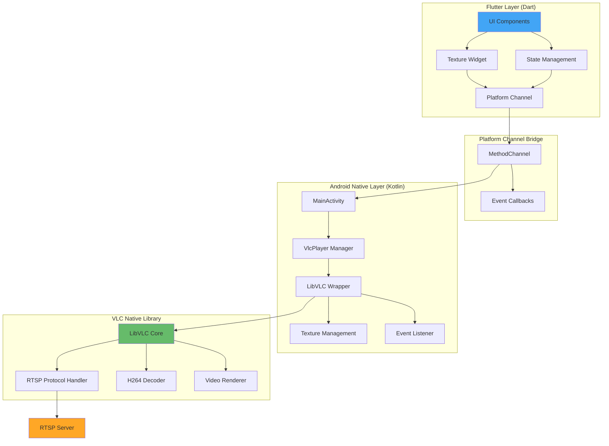
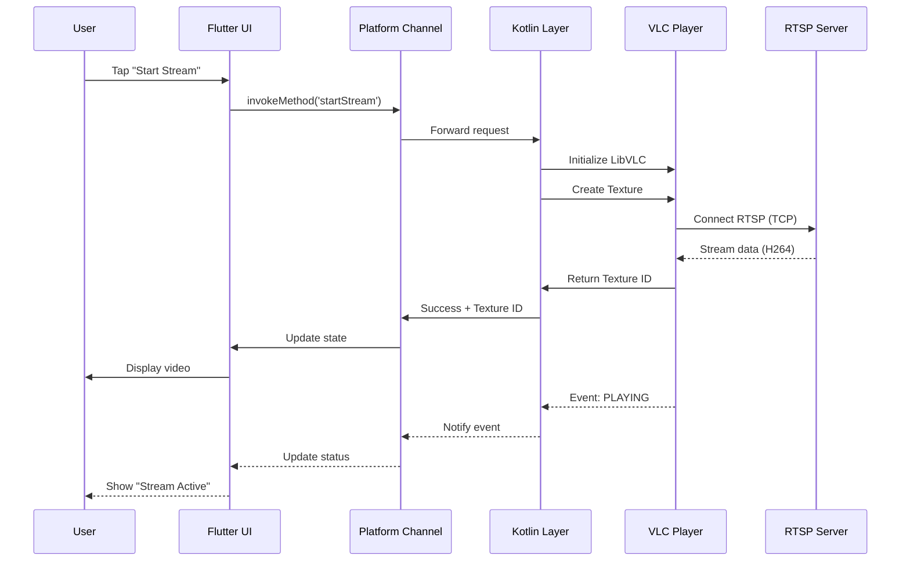
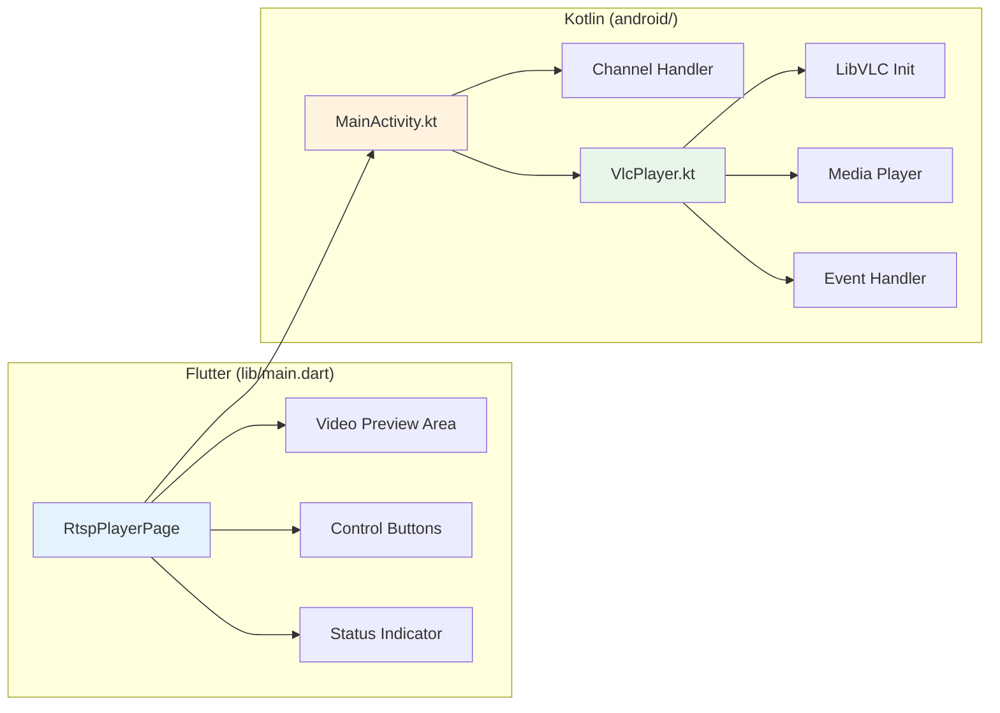
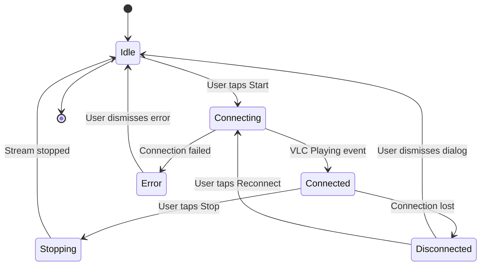
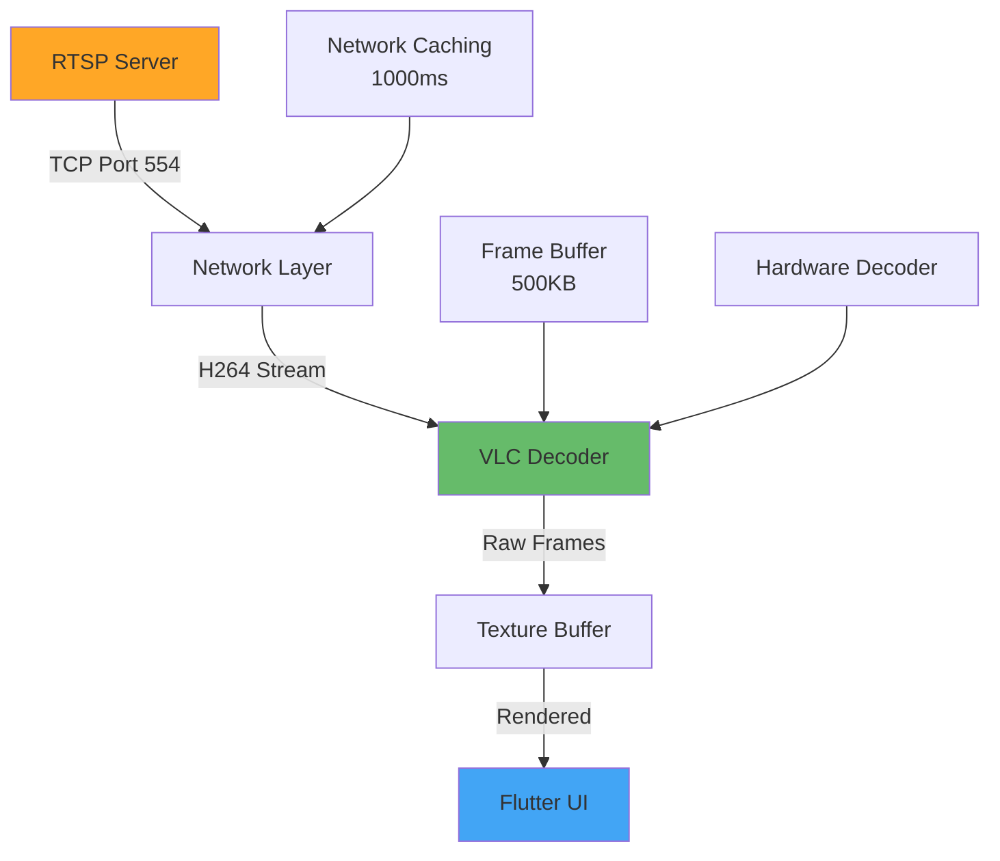
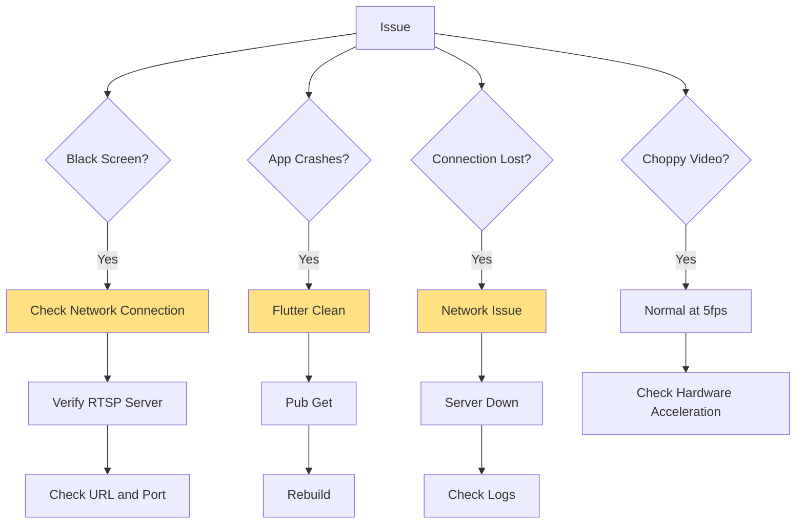
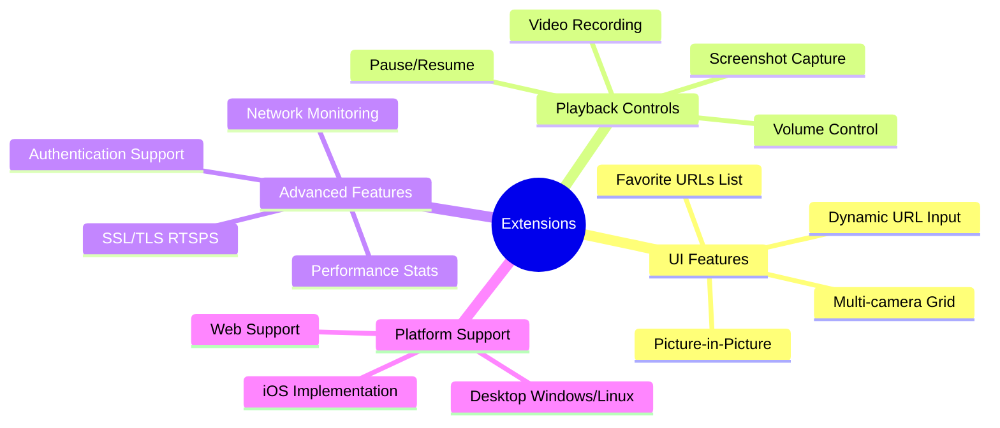
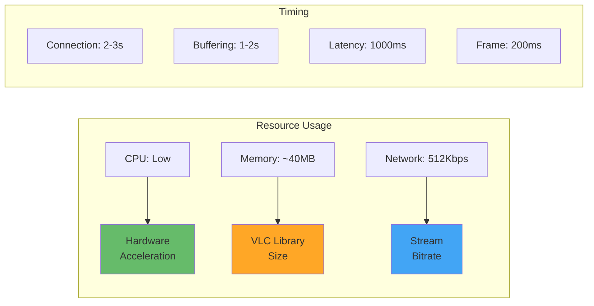

# Flutter RTSP VLC Player - PoC

A Proof of Concept (PoC) Android application built with Flutter for playing RTSP streams using VLC native player through platform channels.

## Table of Contents

- [Overview](#overview)
- [Architecture](#architecture)
- [Features](#features)
- [Quick Start](#quick-start)
- [Configuration](#configuration)
- [Implementation Details](#implementation-details)
- [RTSP Stream Configuration](#rtsp-stream-configuration)
- [Testing](#testing)
- [Troubleshooting](#troubleshooting)
- [Future Extensions](#future-extensions)
- [Technical Specifications](#technical-specifications)

## Overview

This PoC demonstrates real-time RTSP video streaming on Android devices using Flutter UI and native VLC player integration via Kotlin platform channels. The application provides a clean, modern interface for connecting to RTSP streams with automatic error handling and reconnection capabilities.

### Key Highlights

- **Platform**: Android (API 21+)
- **Framework**: Flutter with Kotlin native integration
- **Video Engine**: LibVLC 3.5.4
- **Protocol**: RTSP over TCP
- **Rendering**: Hardware-accelerated texture-based video rendering
- **Latency**: ~400-600ms (configurable)

## Architecture



### Data Flow



### Component Structure



## Features

### Core Functionality

- **Real-time RTSP Streaming**: Low-latency video streaming over RTSP protocol
- **Hardware Acceleration**: Efficient H264 decoding using device hardware
- **Automatic Error Recovery**: Connection loss detection with reconnection dialog
- **TCP Transport**: Reliable streaming using RTSP over TCP
- **Texture-based Rendering**: Smooth video playback using Flutter Texture widget

### User Interface

- Modern Material Design 3 UI
- Connection status indicator (colored dot)
- Stream URL display
- Start/Stop controls
- Automatic reconnection dialog
- Visual feedback for all states (idle, connecting, connected, error)

### States Management



## Quick Start

### Prerequisites

- Flutter SDK (latest stable)
- Android SDK (API 21+)
- Android device or emulator
- Network access to RTSP server

### Installation

```bash
# 1. Install dependencies
flutter pub get

# 2. Connect Android device
flutter devices

# 3. Run the application
flutter run

# 4. For release build
flutter build apk --release
```

### First Run

1. Launch the app
2. Tap the green "Avvia Lettura" (Start Stream) button
3. Wait 2-3 seconds for buffering
4. Video will appear in the preview area
5. Tap red "Ferma" (Stop) button to disconnect

## Configuration

### RTSP Stream URL

Default configuration in `lib/main.dart`:

```dart
final String _rtspUrl = 'rtsp://10.189.148.218:554';
```

To change the URL, modify this value and rebuild the application.

### Video Resolution

Default resolution in `lib/main.dart` (line ~80):

```dart
final result = await platform.invokeMethod('startStream', {
  'url': _rtspUrl,
  'width': 1280,   // Adjust as needed
  'height': 1024,  // Adjust as needed
});
```

### VLC Options

Configure VLC behavior in `android/app/src/main/kotlin/com/example/flutter_rtp/VlcPlayer.kt`:

```kotlin
val options = ArrayList<String>().apply {
    add("--rtsp-tcp")                    // Use TCP instead of UDP
    add("--network-caching=1000")        // Buffer time in ms
    add("--rtsp-frame-buffer-size=500000") // Frame buffer size
    add("--clock-jitter=5000")           // Clock jitter tolerance
    add("--clock-synchro=0")             // Disable auto sync
    add("--avcodec-hw=any")              // Hardware decoding
    add("--no-drop-late-frames")         // Don't drop late frames
    add("--no-skip-frames")              // Don't skip frames
    add("-vvv")                          // Verbose logging
}
```

## Implementation Details

### Project Structure

```
flutter_rtp/
├── lib/
│   └── main.dart                          # Flutter UI and logic
├── android/
│   └── app/
│       ├── build.gradle.kts               # VLC dependency
│       └── src/main/
│           ├── AndroidManifest.xml        # Network permissions
│           └── kotlin/com/example/flutter_rtp/
│               ├── MainActivity.kt        # Platform channel handler
│               └── VlcPlayer.kt           # VLC wrapper
└── README.md                              # This file
```

### Flutter Layer (main.dart)

Key components:

- **RtspPlayerPage**: Main widget with state management
- **Texture Widget**: Displays video from native texture
- **Platform Channel**: Communication bridge to native code
- **Event Callbacks**: Handles stream events (playing, stopped, error)

### Android Native Layer

**MainActivity.kt** - Platform channel handler:
```kotlin
private val CHANNEL = "com.example.flutter_rtp/vlc"

setMethodCallHandler { call, result ->
    when (call.method) {
        "startStream" -> // Initialize and start VLC
        "stopStream" -> // Stop and cleanup VLC
    }
}
```

**VlcPlayer.kt** - LibVLC wrapper:
- Texture creation and management
- LibVLC initialization with options
- MediaPlayer setup and control
- Event handling (stopped, playing, error, buffering)
- Resource cleanup

### Dependencies

**pubspec.yaml**:
```yaml
dependencies:
  flutter:
    sdk: flutter
  cupertino_icons: ^1.0.8
```

**android/app/build.gradle.kts**:
```kotlin
dependencies {
    implementation("org.videolan.android:libvlc-all:3.5.4")
}
```

### Permissions

**AndroidManifest.xml**:
```xml
<uses-permission android:name="android.permission.INTERNET"/>
<uses-permission android:name="android.permission.ACCESS_NETWORK_STATE"/>
```

## RTSP Stream Configuration

### Expected Stream Parameters

The application is optimized for the following RTSP stream configuration:

| Parameter | Value | Notes |
|-----------|-------|-------|
| Protocol | RTSP over TCP | Port 554 |
| Resolution | 1280x1024 | 5:4 aspect ratio |
| Codec | H264 | Hardware accelerated |
| Bitrate | 512 Kbit/s | Low bandwidth |
| Frame Rate | 5 fps | Low frame rate |
| GOP | 25 frames | I-frame interval |
| Quality | 70% | Compression quality |

### Stream Characteristics



### Low Frame Rate Optimization

Since the stream uses 5 fps (frames every 200ms), the application includes specific optimizations:

- **High clock jitter tolerance**: `--clock-jitter=5000`
- **Disabled auto sync**: `--clock-synchro=0`
- **Increased buffer**: `--network-caching=1000`
- **Live caching**: `--live-caching=1000`

**Note**: At 5 fps, the video will appear to update slowly - this is normal and expected behavior for such low frame rates.

## Testing

### Debug Logging

```bash
# Flutter logs
flutter logs

# Android logs
adb logcat | grep -E "VlcPlayer|flutter"

# VLC specific logs
adb logcat | grep VlcPlayer
```

### Test Checklist

- [ ] App launches without errors
- [ ] "Start Stream" button responds to tap
- [ ] Status changes to "Connessione in corso..." (Connecting)
- [ ] Video appears after 2-3 seconds
- [ ] Status indicator turns green when connected
- [ ] Video plays smoothly (considering 5 fps limitation)
- [ ] "Stop" button interrupts the stream
- [ ] Video disappears when stopped
- [ ] Status indicator turns red when disconnected
- [ ] Reconnection dialog appears on connection loss

### Performance Metrics

Expected performance characteristics:

- **Initial connection time**: 2-3 seconds
- **Buffering time**: 1-2 seconds
- **Latency**: 1000ms (due to caching)
- **Frame display rate**: 5 fps (as per server config)
- **CPU usage**: Low (hardware acceleration)
- **Memory usage**: ~40MB (VLC library)

### Testing with Alternative RTSP Servers

To test with VLC desktop as RTSP server:

1. Open VLC Media Player
2. Media → Stream
3. Add a video file
4. Select RTSP as streaming protocol
5. Note the URL (e.g., `rtsp://192.168.1.100:8554/test`)
6. Update the URL in `main.dart`
7. Run the app

### Connectivity Verification

Before testing the app:

```bash
# Ping the server
ping 10.189.148.218

# Check RTSP port
nc -zv 10.189.148.218 554

# Test with FFprobe
ffprobe -rtsp_transport tcp rtsp://10.189.148.218:554

# Test with VLC desktop
vlc rtsp://10.189.148.218:554
```

## Troubleshooting

### Common Issues and Solutions



| Problem | Possible Cause | Solution |
|---------|---------------|----------|
| Black screen | Server not reachable | Verify IP, port, and network |
| App crashes | Corrupted build cache | Run `flutter clean && flutter pub get` |
| High latency | Low caching value | Increase `network-caching` in VlcPlayer.kt |
| Choppy video | Hardware decoder issues | Check logs, try disabling HW acceleration |
| No connection | Permission issues | Verify AndroidManifest.xml permissions |
| "OPENING" but not "PLAYING" | Server not responding | Test with VLC desktop first |
| "BUFFERING" stuck at 0% | Low bitrate or slow network | Increase network-caching |

### Log Analysis

**Successful connection logs**:
```
🔓 MediaPlayer OPENING
⏳ MediaPlayer BUFFERING: 0%
⏳ MediaPlayer BUFFERING: 50%
⏳ MediaPlayer BUFFERING: 100%
▶️ MediaPlayer PLAYING
```

**Error logs to watch for**:
```
❌ MediaPlayer ERROR
🛑 MediaPlayer STOPPED unexpectedly
⚠️ Connection timeout
```

## Future Extensions

### Potential Enhancements



### Implementation Ideas

1. **Dynamic URL Input**: TextField for user-entered RTSP URLs
2. **Saved Favorites**: Store frequently used stream URLs
3. **Playback Controls**: Add pause, resume, and volume controls
4. **Screenshot Feature**: Capture frames from the stream
5. **Multi-camera View**: Grid layout for multiple streams
6. **Stream Recording**: Save stream to local storage
7. **Statistics Overlay**: Display FPS, bitrate, latency
8. **Authentication**: Support for username/password RTSP
9. **Picture-in-Picture**: Android PiP mode support
10. **iOS Support**: Implement Swift/Objective-C platform channel

See code examples in EXTENSIONS.md for implementation details.

## Technical Specifications

### System Requirements

- **OS**: Android 5.0 (API 21) or higher
- **RAM**: 2GB minimum
- **Storage**: 100MB minimum for app
- **Network**: WiFi or mobile data connection
- **Camera Server**: RTSP-compatible server

### Technology Stack

| Component | Technology | Version |
|-----------|-----------|---------|
| Framework | Flutter | Latest stable |
| Language (UI) | Dart | 3.x |
| Language (Native) | Kotlin | 1.9+ |
| Video Library | LibVLC | 3.5.4 |
| Build System | Gradle | 8.x |
| Target SDK | Android | 34 |
| Min SDK | Android | 21 |

### Performance Characteristics



### Comparison with Original Java Implementation

| Aspect | Java Original | Flutter PoC | Advantage |
|--------|--------------|-------------|-----------|
| UI Framework | XML Layouts | Flutter Widgets | Cross-platform ready |
| Rendering | SurfaceView | Texture Widget | Better integration |
| Development | Java | Dart + Kotlin | Modern languages |
| Hot Reload | No | Yes | Faster development |
| UI Responsiveness | Good | Excellent | Reactive framework |
| Code Maintainability | Standard | High | Cleaner architecture |

## License

This is a Proof of Concept application. Check LibVLC licensing requirements for production use.

## Support and Contribution

This is a PoC project demonstrating RTSP streaming capabilities in Flutter. For issues or questions:

1. Check the troubleshooting section
2. Review Flutter logs: `flutter logs`
3. Verify RTSP server connectivity
4. Test with VLC desktop player first

---

**Project Status**: ✅ Complete and ready for testing  
**Version**: 1.0.0  
**Platform**: Android Only  
**Type**: Proof of Concept
